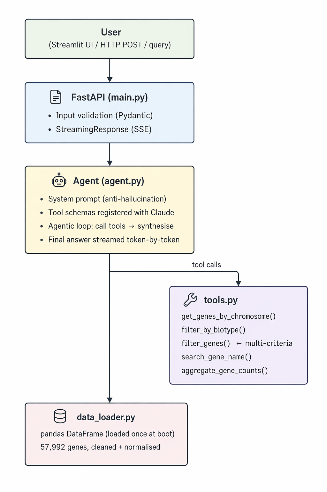

# Gene Research Assistant

A natural language query interface over a structured human gene dataset (57,992 genes). Built with **FastAPI**, **Anthropic SDK**, **pandas**, and **Streamlit**. Uses tool-based agentic reasoning tailored for structured data to answer questions accurately while minimizing hallucination.

This system follows a RAG-style architecture (retrieval + generation), where retrieval is implemented via structured query tools instead of vector search.

---

## Quick Start

```bash
# 1. Clone and set up environment
git clone https://github.com/inquisitour/datavisyn-research-assistant.git
cd datavisyn-research-assistant
python -m venv venv
source venv/bin/activate  # Windows: venv\Scripts\activate
pip install -r requirements.txt

# 2. Create .env file and add your API key
# Create a file named .env in the project root with:
# ANTHROPIC_API_KEY=sk-ant-...

# 3. Set dataset path
export DATA_PATH=/path/to/genes.csv

# 4. Start the API
uvicorn main:app --reload --port 8000

# 5. Start the UI (separate terminal)
streamlit run app.py
```

---

## Architecture



**Data flow:**
1. User sends a natural language question via Streamlit UI or `POST /query`.
2. FastAPI passes it to the async `stream_agent()`.
3. The agent sends the question + tool schemas to Claude.
4. Claude decides which tool(s) to call. It never sees the raw CSV.
5. Tool functions query the clean pandas DataFrame and return structured JSON.
6. Tool results are fed back to Claude, which synthesises a grounded answer.
7. The final answer is streamed token-by-token via SSE to the client.

---

## Project Structure

```
gene-research-ai/
├── main.py          # FastAPI app, /query endpoint, SSE streaming
├── agent.py         # Anthropic API client, tool schemas, agentic loop
├── tools.py         # Data query functions (5 tools)
├── data_loader.py   # CSV loading, column normalisation, biotype cleaning
├── models.py        # Pydantic request/response schemas
├── app.py           # Streamlit UI with streaming chat interface
├── evals.py         # Evaluation suite (10 cases, accuracy report)
├── genes.csv        # Gene dataset (semicolon-delimited)
├── requirements.txt
└── README.md
```

---

## Why Tool-Based Querying Instead of Naive RAG

| Dimension | Naive RAG | Tool-Based (this system) |
|---|---|---|
| **Data type fit** | Optimised for unstructured text | Optimised for structured/tabular data |
| **Accuracy** | Embedding similarity ≠ exact filter | Exact pandas predicates |
| **Hallucination risk** | Model may blend chunks | Model only sees real query results |
| **Aggregation** | Nearly impossible via embeddings | Native `value_counts()` / groupby |
| **Latency** | Embedding retrieval + rerank overhead | Direct DataFrame operation (ms) |
| **Scalability** | Vector DB needed at scale | SQL/columnar DB drop-in replacement |

The gene dataset is **structured tabular data with exact categorical values** (chromosome numbers, biotype categories, Ensembl IDs).

I think embedding-based retrieval is less suitable for structured tabular data where exact filtering is required, a query for "genes on chromosome 17" must return *all* chromosome-17 genes, not a cosine-similarity approximation.

This approach improves determinism and reduces hallucination risk in structured domains like biomedical data.

---

## Tech Stack Decision: Anthropic SDK over Pydantic AI

At the time of building, Pydantic AI was evaluated, but for this implementation I chose the Anthropic SDK to have finer control over streaming and tool execution. 

Pydantic is still used throughout for schema validation (`models.py`). The agent architecture mirrors what a Pydantic AI implementation would produce (tool schemas, agentic loop, structured outputs), implemented at a lower level for reliability and control. Happy to discuss the trade-offs or walk through what this would look like in Pydantic AI.

Note on LLM provider: This implementation uses the Anthropic Claude API. The agent layer (agent.py) is the only provider-specific component and swapping to another provider (e.g., OpenAI) would only require updating the client integration and tool schema format, while the rest of the system remains unchanged.

---

## Tools Implemented

| Tool | Purpose |
|---|---|
| `get_genes_by_chromosome(chromosome)` | All genes on a specific chromosome |
| `filter_by_biotype(biotype)` | Genes of a specific biotype |
| `filter_genes(chromosome, biotype, name)` | Multi-criteria filter in a single call |
| `search_gene_name(name)` | Keyword search in gene names and symbols |
| `aggregate_gene_counts(field)` | Count genes grouped by chromosome or biotype |

The `filter_genes` tool was added after observing the agent making multiple separate tool calls for combined queries (e.g. chromosome + biotype). This reduced both latency and token usage significantly.

---

## Data Loading & Normalisation

### What was handled
- **Semicolon delimiter:** `pd.read_csv(path, sep=";", dtype=str)`
- **Column renaming:** `Seq region start` → `start`, `Seq region end` → `end`
- **Missing values:** `gene_symbol` and `name` → `""` (empty string); `biotype` → `"unknown"`
- **Biotype normalisation:** `"Linc R N A"` → `"linc_r_n_a"`, `"Protein Coding"` → `"protein_coding"`
- **Source annotation stripping:** `[Source:HGNC Symbol;Acc:HGNC:XXXX]` removed from gene names at load time
- **Fuzzy biotype matching:** `"linc_rna"` matches `"linc_r_n_a"` by stripping underscores before comparison

### Why these choices
Raw biotype values like `"Linc R N A"` have inconsistent spacing from the source data. Normalising to snake_case at load time means all downstream tools operate on consistent values without per-query cleaning overhead.

---

## Anti-Hallucination Mechanisms

1. **System prompt constraint:** Model is explicitly told to only answer using tool data. If no data found, say so.
2. **No raw data in context:** The CSV is never loaded into the prompt. The LLM reasons only over structured JSON returned by tools.
3. **Tool-only grounding:** Agent loop enforces at least one tool call before answering.
4. **Result capping:** Tool outputs capped at 50 genes with the true total always reported which prevents context overflow while maintaining accuracy.
5. **Out-of-scope refusal:** Verified by eval E10 and questions outside the dataset (e.g. "capital of France") are rejected gracefully.

---

## Streaming Implementation

The agent uses a two-phase approach:
1. **Tool-calling phase:** Non-streaming requests to capture `tool_use` blocks.
2. **Final synthesis phase:** Streaming via `_async_client.messages.stream()` using `get_final_message()`.

This eliminates the previous "peek" round-trip that added ~1-2s latency per query. The Streamlit UI consumes the SSE stream and renders the final response with `st.markdown()` after streaming completes, ensuring proper markdown rendering.

---

## Scaling to Millions of Genes

| Layer | Change needed |
|---|---|
| **Storage** | Replace pandas with PostgreSQL + indexed columns (`chromosome`, `biotype`, `gene_symbol`) |
| **Tools** | Rewrite as parameterised SQL queries with `LIMIT` pagination |
| **Agent** | Add `get_gene_by_ensembl_id` point-lookup; add pagination tokens |
| **API** | Deploy behind load balancer; stateless workers read from shared DB |
| **Caching** | Cache frequent aggregations (biotype counts) with Redis TTL |

The `tools.py` function contracts remain unchanged, only the underlying data layer swaps needed.

---

## LLM Cost Considerations

| Factor | Impact |
|---|---|
| Tool schemas | ~300 tokens per request (fixed overhead) |
| Tool results | Capped at 50 genes per response |
| Multi-turn loops | Each tool-calling round = one extra API call |
| Model | `claude-sonnet-4` for all queries |

**Cost-reduction strategies:**
- Tool result payloads capped at top-N genes + total count
- Cache common aggregations at the API layer
- Use `claude-haiku` for simple lookups, `claude-sonnet` for complex synthesis
- The `filter_genes` multi-criteria tool reduces multi-call scenarios to single calls

---

## Evaluation Results

```bash
python evals.py
```

10 test cases covering: chromosome filters, biotype filters, name searches, aggregations, and out-of-scope refusal.

```
Results: All test cases passed (10/10)
```

---

## API Endpoints

| Endpoint | Method | Description |
|---|---|---|
| `/query` | POST | Natural language query, streamed SSE response |
| `/stats` | GET | Dataset summary statistics |
| `/health` | GET | Liveness check |

### Example
```bash
curl -X POST http://localhost:8000/query \
  -H "Content-Type: application/json" \
  -d '{"question": "Which genes on Chromosome 17 are associated with G protein-coupled receptors?"}' \
  --no-buffer
```

---

## Example Queries

| Query | Tool(s) called |
|---|---|
| Which genes on chromosome 17 are protein coding? | `filter_genes(chromosome="17", biotype="protein_coding")` |
| Find all glutathione peroxidase genes | `search_gene_name("glutathione peroxidase")` |
| How many genes per chromosome? | `aggregate_gene_counts("chromosome")` |
| List pseudogenes on chromosome X | `filter_genes(chromosome="X", biotype="pseudogene")` |
| What biotypes exist in the dataset? | `aggregate_gene_counts("biotype")` |
| What is the capital of France? | Refused (out of scope) |

---

## Iterative Improvements Made

| Issue observed | Fix applied |
|---|---|
| Context overflow with 57k genes | Capped tool results at 50 genes per call |
| Agent calling multiple tools for combined queries | Added `filter_genes()` multi-criteria tool |
| Extra API round-trip adding ~1-2s latency | Eliminated "peek" call; use `get_final_message()` |
| Biotype mismatch (`linc_rna` vs `linc_r_n_a`) | Strip underscores before comparison |
| `[Source:HGNC...]` clutter in gene names | Regex strip at data load time |
| Markdown not rendering during streaming | Post-process with `fix_formatting()` after stream completes |